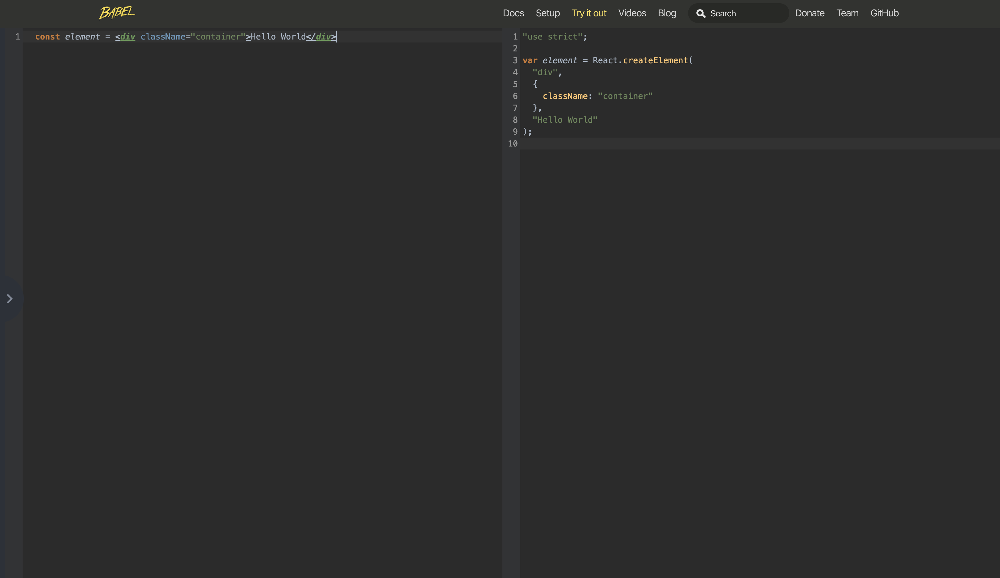

# The Beginner's Guide to React

- [A Beginners Guide to React Introduction](#a-beginners-guide-to-react-introduction)
- [Create a User Interface with Vanilla JavaScript and DOM](#create-a-user-interface-with-vanilla-javascript-and-dom)
- [Create a User Interface with React’s createElement API](#create-a-user-interface-with-reacts-createelement-api)
- [Create a User Interface with React’s JSX syntax](#create-a-user-interface-with-reacts-jsx-syntax)
- [Use JSX effectively with React](#use-jsx-effectively-with-react)
- [Render two elements side-by-side with React Fragments](#render-two-elements-side-by-side-with-react-fragments)
- [Create a Simple Reusable React Component](#create-a-simple-reusable-react-component)
- [Validate Custom React Component Props with PropTypes](#validate-custom-react-component-props-with-proptypes)
- [Understand and Use Interpolation in JSX](#understand-and-use-interpolation-in-jsx)
- [Rerender a React Application](#rerender-a-react-application)
- [Style React Components with className and inline Styles](#style-react-components-with-classname-and-inline-styles)
- [Use Event Handlers with React](#use-event-handlers-with-react)
- [Manage state in a React Component with the useState hook](#manage-state-in-a-react-component-with-the-usestate-hook)
- [Manage side-effects in a React Component with the useEffect hook](#manage-side-effects-in-a-react-component-with-the-useeffect-hook)
- [Use a lazy initializer with useState](#use-a-lazy-initializer-with-usestate)
- [Manage the useEffect dependency array](#manage-the-useeffect-dependency-array)
- [Create reusable custom hooks](#create-reusable-custom-hooks)
- [Manipulate the DOM with React refs](#manipulate-the-dom-with-react-refs)
- [Understand the React Hook Flow](#understand-the-react-hook-flow)
- [Make Basic Forms with React](#make-basic-forms-with-react)
- [Make Dynamic Forms with React](#make-dynamic-forms-with-react)
- [Controlling Form Values with React](#controlling-form-values-with-react)
- [Using React Error Boundaries to handle errors in React Components](#using-react-error-boundaries-to-handle-errors-in-react-components)
- [Use the key prop when Rendering a List with React](#use-the-key-prop-when-rendering-a-list-with-react)
- [Lifting and colocating React State](#lifting-and-colocating-react-state)
- [Make HTTP Requests with React](#make-http-requests-with-react)
- [Handle HTTP Errors with React](#handle-http-errors-with-react)
- [Install and use React DevTools](#install-and-use-react-devtools)
- [Build and deploy a React Application](#build-and-deploy-a-react-application)
- [A Beginners Guide to React Outro](#a-beginners-guide-to-react-outro)


## A Beginners Guide to React Introduction

- No requirements needed when taking this course.
- Recommend that you watch all of these videos through once without touching the keyboard. Just take notes. Then watch them a second time and follow along and change/break the code and review the bits that you need.
- Download or clone the source code: [**Course Repo**](https://github.com/kentcdodds/beginners-guide-to-react/tree/egghead) and ⚠️ switch to the egghead branch.
- Copy and paste the `start` script in a terminal window to locally serve all the files. Access the files in `localhost:3000`.
  - `npx browser-sync start --server --files "./*.html" --no-open --no-notify --directory`
  - `npx` comes bundled with Node.js
  - browsersync automatically reloads any changes made to the code.
  - More info on [browsersync](https://github.com/wesbos/browser-sync-remote-example)

**Recommended setup**:

- code editor opened
- browsersync running
- developer tools opened


### Additional resource

- Check out Kent's [Uses Page](https://kentcdodds.com/uses/) to learn more about his setup.
- [Course Notes](https://github.com/eggheadio-projects/the-beginners-guide-to-react)


## Create a User Interface with Vanilla JavaScript and DOM

- To create a user interface with JavaScript you will need a place to append your JavaScript DOM (Document Object Model) elements. This will be the `root` of our application.
- Get access to that element using the document's API.
- We create our element and add properties to it.
- Finally, appended it to the DOM element.

```html
<body>
  <div id="root"></div>
  <script type="text/javascript">
    const rootElement = document.getElementById('root');
    const element = document.createElement('div');
    element.textContent = 'Hello World';
    element.className = 'container';
    rootElement.appendChild(element);
  </script>
</body>
```

### Additional resource

- [Egghead - Select a DOM Element with document.getElementById](https://egghead.io/lessons/javascript-select-a-dom-element-with-document-getelementbyid)
- [MDN - `Element` Documentation](https://developer.mozilla.org/en-US/docs/Web/API/Element)


## Create a User Interface with React’s createElement API

- React uses the same APIs to control and update the DOM that we did in the previous lesson.
- Instead of creating DOM elements, we’ll create React elements and then hand those off to `react-dom` to handle turning those into DOM elements and putting them into the page.
- If you’ve ever learned or used React before, you’re probably more familiar with JSX than React’s `createElement` API, but it’s important to understand the `createElement` API first so you understand the magic.
- Get `react` and `react-dom` from unpkg.com, using a fixed version:

```
unpkg.com/react@16.12.0/umd/react.production.min.js
unpkg.com/react-dom@16.12.0/umd/react-dom.production.min.js
```

- And add a `script` tag to the page:

```html
<script src="https://unpkg.com/react@16.12.0/umd/react.development.js"></script>
<script src="https://unpkg.com/react-dom@16.12.0/umd/react-dom.development.js"></script>
```

```html
<body>
  <div id="root"></div>
  <script src="https://unpkg.com/react@16.12.0/umd/react.development.js"></script>
  <script src="https://unpkg.com/react-dom@16.12.0/umd/react-dom.development.js"></script>
  <script type="text/javascript">
    const rootElement = document.getElementById('root');
    // specify properties on creation, as an object
    const element = React.createElement('div', {
      className: 'container',
      children: 'Hello World'
    });
    // use `react-dom` to render those elements to the page
    console.log(element);
    // props argument is what we passed as a second argument
    // we can also specify it as an array
    // Example: children: ['Hello World', ", Goodbye World"]
    ReactDOM.render(element, rootElement);
  </script>
</body>
```

- Now with `react` you can create `React.createElement` and use `react-dom` to render those elements to the page.
- `React.createElement` API is as simple as the element that you want to create `<div>`, and then an object that has all of the props that you want to have applied, `className`, `children`.
- Just as a convenience, you can provide the `children` with any number of arguments after the props argument as well.

### Additional resource

- [React Top-Level API](https://reactjs.org/docs/react-api.html)
- [React Without JSX](https://reactjs.org/docs/react-without-jsx.html)


## Create a User Interface with React’s JSX syntax

- React team came up with [JSX](https://reactjs.org/docs/introducing-jsx.html). It’s an extension to the JavaScript language to support syntax that looks similar to the HTML that you would write to create these DOM elements (there are a handful of differences).
- JSX gives us an expressive syntax for representing our UI, without losing the benefits and powers of writing our UI in JavaScript.
- The best way to take advantage of this is to learn how JSX is compiled to regular JavaScript. By default the browser does not compile JSX, it needs [Babel](https://babeljs.io) to compile non-standard features, like JSX.
  - **Tip**: Spend some time exploring how Babel compiles JSX, this will help you be more effective when using JSX. [See Example:](https://babeljs.io/repl#?browsers=&build=&builtIns=false&spec=false&loose=false&code_lz=ATDGHsDsGcBdgKYBsEFsGXgXmAHgCYCWAbmEgIbTQBy56WARBJuYZAgE4MB8AEsknDAA6uA5J8uAPRFi3IA&debug=false&forceAllTransforms=false&shippedProposals=false&circleciRepo=&evaluate=false&fileSize=false&timeTravel=false&sourceType=module&lineWrap=false&presets=es2015%2Creact%2Cstage-2&prettier=true&targets=&version=7.8.7&externalPlugins=)



- Use Babel in the browser, by adding a `script` tag to `babel/standalone` and adding a new tag with `type='text/babel'`;

```html
<script src="https://unpkg.com/@babel/standalone@7.8.3/babel.js"></script>
```

```html
<body>
  <div id="root"></div>
  <script src="https://unpkg.com/react@16.12.0/umd/react.development.js"></script>
  <script src="https://unpkg.com/react-dom@16.12.0/umd/react-dom.development.js"></script>
  <script src="https://unpkg.com/@babel/standalone@7.8.3/babel.js"></script>
  <script type="text/babel">
    const rootElement = document.getElementById('root');
    const element = <div className="container">Hello World</div>;
    ReactDOM.render(element, rootElement);
  </script>
</body>
```

This will add a new script with our new code compiled by Babel. In a production environment, it's not recommended that you use babel/standalone.

### Additional resource

- [Introducing JSX](https://reactjs.org/docs/introducing-jsx.html)
- [What is Babel?](https://babeljs.io/docs/en/)
- [Configure babel for React with preset-react](https://egghead.io/lessons/react-configure-babel-for-react-with-preset-react)


## Use JSX effectively with React

- JSX is not an entirely different language, but it is a bit of an extension to the language, so knowing how you would express certain JavaScript things within the JSX syntax is important to using JSX effectively.

- To interpolation use `{ }`. Any JavaScript expression inside of the curly braces will be evaluated and passed to the `React.createElement` API. This allows you to be expressive when building out UI's. Example:

```html
<script type="text/babel">
  const rootElement = document.getElementById('root');
  // declaring variables
  const children = 'Hello World';
  const className = 'container';
  // interpolation
  const element = <div className={className}>{children}</div>;
  ReactDOM.render(element, rootElement);
</script>
```

Since this is JSX and not HTML, you can use self-closing tags:

```html
<script type="text/babel">
  const rootElement = document.getElementById('root');
  const children = 'Hello World';
  const className = 'container';
  const props = { children, className };
  // self-closing tags
  const element = <div {...props} />;
  ReactDOM.render(element, rootElement);
</script>
```

- The spread operator takes either an array or an object and expands it into its set of items. We can use the spread operator to pass down our props to the `React.createElement` API:

```html
<body>
  <div id="root"></div>
  <script src="https://unpkg.com/react@16.12.0/umd/react.development.js"></script>
  <script src="https://unpkg.com/react-dom@16.12.0/umd/react-dom.development.js"></script>
  <script src="https://unpkg.com/@babel/standalone@7.8.3/babel.js"></script>
  <script type="text/babel">
    const rootElement = document.getElementById('root');
    const children = 'Hello World';
    const className = 'container';
    const props = { children, className };
    // using spread operator
    const element = <div {...props} />;
    ReactDOM.render(element, rootElement);
  </script>
</body>
```

- You can also add or extended props in a declarative and deterministic way.

### Additional resource

- [Understanding the Spread Operator in JavaScript](https://zendev.com/2018/05/09/understanding-spread-operator-in-javascript.html)
- [MDN Spread syntax](https://developer.mozilla.org/en-US/docs/Web/JavaScript/Reference/Operators/Spread_syntax)


## Render two elements side-by-side with React Fragments

- In React, you can’t render two React elements side-by-side (`<span>Hello</span><span>World</span>`). They have to be wrapped in another element (like a `<div>`).
- This may seem like an odd limitation, but when you think about the fact that JSX is compiled to `React.createElement` calls, it makes sense.
- [React Fragments](https://reactjs.org/docs/fragments.html) let you group a list of children without adding extra nodes to the DOM.
- Using the **React Fragments API**:

```html
<body>
  <div id="root"></div>
  <script src="https://unpkg.com/react@16.12.0/umd/react.development.js"></script>
  <script src="https://unpkg.com/react-dom@16.12.0/umd/react-dom.development.js"></script>
  <script src="https://unpkg.com/@babel/standalone@7.8.3/babel.js"></script>
  <script type="text/babel">
    const helloElement = React.createElement('span', null, 'Hello');
    const worldElement = React.createElement('span', null, 'World');
    // Using the React Fragments API:
    const element = React.createElement(
        React.Fragment,
        null,
        helloElement
        worldElement
    )
    ReactDOM.render(element, document.getElementById('root'));
  </script>
</body>
```

- You can also use a **React Fragments Element**:

```js
const element = (
  <React.Fragment>
    <span>Hello</span>
    <span>World</span>
  </React.Fragment>
);
```

- Since React Fragments is so common, JSX has a **special syntax** for it:

```js
const element = (
  // open and closing angle brackets
  <>
    <span>Hello</span>
    <span>World</span>
  </>
);
```

### Additional resource

- [React doc- Fragments](https://reactjs.org/docs/fragments.html)


## Create a Simple Reusable React Component

- One of the biggest paradigm shifts that React offered to the UI ecosystem was the component model.
- Components let you split the UI into independent, reusable pieces, and think about each piece in isolation.

```html
<body>
  <div id="root"></div>
  <script src="https://unpkg.com/react@16.12.0/umd/react.development.js"></script>
  <script src="https://unpkg.com/react-dom@16.12.0/umd/react-dom.development.js"></script>
  <script src="https://unpkg.com/@babel/standalone@7.8.3/babel.js"></script>
  <script type="text/babel">
    // creating a function component, that accepts a props object and returns a React Element
    // it passes JSX attributes and children to this component as a single object “props”
    function Message({ children }) {
      return <div className="message">{children}</div>;
    }

    const element = (
      <div className="container">
        <Message>Hello World</Message>
        <Message>Goodbye World</Message>
      </div>
    );

    ReactDOM.render(element, document.getElementById('root'));
  </script>
</body>
```

- **Rendering** a Component:

```js
//  capitalized to ensure that babel passes the function rather than the string message
const element = (
  <div className="container">
    <Message>Hello World</Message>
    <Message>Goodbye World</Message>
  </div>
);
```

### Additional resource

- [React doc - Components and Props](https://reactjs.org/docs/components-and-props.html)


## Validate Custom React Component Props with PropTypes

- When you create reusable React components, you want to make sure that people use them correctly. The best way to do this is to use TypeScript in your codebase to give you compile-time checking of your code.
- If you’re not using TypeScript, you can still use PropTypes to get runtime validation.
- **Using PropTypes**:

```html
<body>
  <div id="root"></div>
  <script src="https://unpkg.com/react@16.12.0/umd/react.development.js"></script>
  <script src="https://unpkg.com/react-dom@16.12.0/umd/react-dom.development.js"></script>
  <script src="https://unpkg.com/@babel/standalone@7.8.3/babel.js"></script>
  <script type="text/babel">

    function SayHello({ firstName, lastName }) {
       return (
         <div>
           Hello {firstName} {lastName}!
         </div>
       );
     }

     const PropTypes = {
       string(props, propName, componentName) {
         if (typeof props[propName] !== 'string') {
           return new Error(
             `Hey, the component ${componentName} needs the prop ${propName} to be a string`
           );
         }
       }
     };

     SayHello.propTypes = {
         firstName: PropTypes.string.isRequired
         lastName: PropTypes.string
     }

     const element = <SayHello firstName={false}>

     ReactDOM.render(element, document.getElementById('root'));
  </script>
</body>
```

- Using **`prop-types`** from unpkg:

```html
<body>
  <div id="root"></div>
  <script src="https://unpkg.com/react@16.12.0/umd/react.production.min.js"></script>
  <script src="https://unpkg.com/react-dom@16.12.0/umd/react-dom.production.min.js"></script>
  <script src="https://unpkg.com/@babel/standalone@7.8.3/babel.js"></script>
  <script src="https://unpkg.com/prop-types@15.6.1/prop-types.js"></script>
  <script type="text/babel">
    const rootElement = document.getElementById('root');

    function SayHello({ firstName, lastName }) {
      return (
        <div>
          Hello {firstName} {lastName}!
        </div>
      );
    }

    // prop-types creates a global variable called propTypes
    // passing .isRequired
    SayHello.propTypes = {
      firstName: PropTypes.string.isRequired,
      lastName: PropTypes.string.isRequired
    };

    const element = <SayHello firstName={false} />;

    ReactDOM.render(element, rootElement);
  </script>
</body>
```

- PropTypes are not rendered on production. You can also remove PropTypes using the [babel-plugin-transform-react-remove-prop-types](https://www.npmjs.com/package/babel-plugin-transform-react-remove-prop-types).

### Additional resource

- [npm - prop-types](https://www.npmjs.com/package/prop-types])
- [React Docs - Typechecking With PropTypes](https://reactjs.org/docs/typechecking-with-proptypes.html)


## Understand and Use Interpolation in JSX

- **Template literals** are string literals allowing embedded expressions. You can use multi-line strings and string interpolation features with them.
- Let’s write a React component that has some conditional logic in it to explore the interpolation characteristics of JSX syntax:

```html
<body>
  <div id="root"></div>
  <script src="https://unpkg.com/react@16.12.0/umd/react.development.js"></script>
  <script src="https://unpkg.com/react-dom@16.12.0/umd/react-dom.development.js"></script>
  <script src="https://unpkg.com/@babel/standalone@7.8.3/babel.js"></script>
  <script type="text/babel">
    function CharacterCount({ text }) {
      // this is JavaScript land
      return (
        // inside of the brackets it's React land
        <div>
          {/* this is all JavaScript land  */}
          {`The text "${text}" has `}
          {/* this is a conditional (ternary) operator */}
          {/* This operator is frequently used as a shortcut for the if statement */}
          {text.length ? <strong>{text.length}</strong> : 'No'}
          {' characters'}
        </div>
        // this is JavaScript land
      );
    }

    const element = (
      <>
        <CharacterCount text="Hello World" />
        <CharacterCount text="" />
      </>
    );

    ReactDOM.render(element, document.getElementById('root'));
  </script>
</body>
```

- Inside the curly braces, it's _JavaScript land_, but it's limited to only expressions.
- Interpolation is not unique to React or JavaScript, we also see it in HTML when we use `script` tags or `style` tags.

```html
<body>
  <div id="root"></div>
  <script src="https://unpkg.com/react@16.12.0/umd/react.development.js"></script>
  <script src="https://unpkg.com/react-dom@16.12.0/umd/react-dom.development.js"></script>
  <script src="https://unpkg.com/@babel/standalone@7.8.3/babel.js"></script>
  <script type="text/babel">
    function CharacterCount({ text }) {
      return (
        <div>
          {/* this is all JavaScript land  */}
          {/* but it's limited to only expressions that evaluate to some value */}
          {/* no loops, switch, or if statements  */}
          {`The text "${text}" has `}
          {text.length ? <strong>{text.length}</strong> : 'No'}
          {' characters'}
        </div>
      );
    }

    const element = (
      <>
        <CharacterCount text="Hello World" />
        <CharacterCount text="" />
      </>
    );

    ReactDOM.render(element, document.getElementById('root'));
  </script>
</body>
```

### Additional resource

- [MDN - Template literals](https://developer.mozilla.org/en-US/docs/Web/JavaScript/Reference/Template_literals)
- [Conditional (ternary) operator](https://developer.mozilla.org/en-US/docs/Web/JavaScript/Reference/Operators/Conditional_Operator)
- [What is JSX? - Kent's Blog](https://kentcdodds.com/blog/what-is-jsx/)


## Rerender a React Application

- Updating the DOM is typically the slowest part of the whole process. React only updates what’s necessary.
- React DOM compares the element and its children to the previous one, and only applies the DOM updates necessary to bring the DOM to the desired state.
- When we re-render the entire app with `setInterval` you can see the clock changes without a browser window refresh.

```html
<body>
  <div id="root"></div>
  <script src="https://unpkg.com/react@16.12.0/umd/react.development.js"></script>
  <script src="https://unpkg.com/react-dom@16.12.0/umd/react-dom.development.js"></script>
  <script src="https://unpkg.com/@babel/standalone@7.8.3/babel.js"></script>
  <script type="text/babel">
    const rootElement = document.getElementById('root');

    function tick() {
      const time = new Date().toLocaleTimeString();
      const element = `
        <div>
          <input value="${time}" />
          <input value="${time}" />
        </div>
      `;
      rootElement.innerHTML = element;
    }

    tick();
    setInterval(tick, 1000);
  </script>
</body>
```

- The `focus` remains on the selected element because React keeps track of it. React also keeps track of the actual changes within our app so even though we call `ReactDOM.render` every second, it will not refresh every element inside, just the `time` value.

```html
<body>
  <div id="root"></div>
  <script src="https://unpkg.com/react@16.12.0/umd/react.development.js"></script>
  <script src="https://unpkg.com/react-dom@16.12.0/umd/react-dom.development.js"></script>
  <script src="https://unpkg.com/@babel/standalone@7.8.3/babel.js"></script>
  <script type="text/babel">
    const rootElement = document.getElementById('root');

    function tick() {
      const time = new Date().toLocaleTimeString();
      const element = (
        <>
          <input value={time} />
          <input value={time} />
        </>
      );
      ReactDOM.render(element, rootElement);
    }

    tick();
    setInterval(tick, 1000);
  </script>
</body>
```

- Even though we create an element describing the whole UI tree on every tick, only the text node whose contents have changed gets updated by React DOM.

### Additional resource

- [kent's Blog - One simple trick to optimize React re-renders](https://kentcdodds.com/blog/optimize-react-re-renders/)
- [React Docs - Rendering Elements](https://reactjs.org/docs/rendering-elements.html)
- [React Docs - ReactDOM](https://reactjs.org/docs/react-dom.html)


## Style React Components with className and inline Styles

- The application layout is only one part of the user interface equation. Another part is **styling**.

```html
<body>
  <div id="root"></div>
  <script src="https://unpkg.com/react@16.12.0/umd/react.development.js"></script>
  <script src="https://unpkg.com/react-dom@16.12.0/umd/react-dom.development.js"></script>
  <script src="https://unpkg.com/@babel/standalone@7.8.3/babel.js"></script>
  <style>
    .box {
      border: 1px solid #333;
      display: flex;
      flex-direction: column;
      justify-content: center;
      text-align: center;
    }
    .box--large {
      width: 270px;
      height: 270px;
    }
    .box--medium {
      width: 180px;
      height: 180px;
    }
    .box--small {
      width: 90px;
      height: 90px;
    }
  </style>
  <script type="text/babel">
    function Box({ style, size, className = '', ...rest }) {
      const sizeClassName = size ? `box--${size}` : '';
      return (
        <div
          className={`box ${className} ${sizeClassName}`}
          style={{ fontStyle: 'italic', ...style }}
          {...rest}
        />
      );
    }

    const element = (
      <div>
        <Box size="small" style={{ backgroundColor: 'lightblue' }}>
          small lightblue box
        </Box>
        <Box size="medium" style={{ backgroundColor: 'pink' }}>
          medium pink box
        </Box>
        <Box size="large" style={{ backgroundColor: 'orange' }}>
          large orange box
        </Box>
        <Box>sizeless box</Box>
      </div>
    );

    ReactDOM.render(element, document.getElementById('root'));
  </script>
</body>
```

- One of the most basic ways to style React components is with inline CSS. JSX elements can take a style attribute which takes in an object:

```js
const element = (
  <div>
    <div
      className="box box--small"
      style={{ fontStyle: 'italic', backgroundColor: 'lightblue' }}
    >
      small lightblue box
    </div>
  </div>
);
```

- The style property is wrapped in **two sets of curly braces**, one to interpolate JavaScript and the second to define the object.

```js
function Box({ style, size, className = '', ...rest }) {
  return (
    <div
      className={`box ${className}`}
      style={{ fontStyle: 'italic', ...style }}
      {...rest}
    />
  );
}
```

The next thing we'll do is make a reusable Box component. It would be better if the author could just define a size like `small`, `medium` or `large`. In this example we destructure size instead of `className`. That's why we could replace `className` with a size property that takes in a string:

```js
function Box({ style, size, className = '', ...rest }) {
  const sizeClassName = size ? `box--${size}` : '';
  return (
    <div
      className={`box ${className} ${sizeClassName}`}
      style={{ fontStyle: 'italic', ...style }}
      {...rest}
    />
  );
}

const element = (
  <div>
    <Box size="small" style={{ backgroundColor: 'lightblue' }}>
      small lightblue box
    </Box>
    <Box size="medium" style={{ backgroundColor: 'pink' }}>
      medium pink box
    </Box>
    <Box size="large" style={{ backgroundColor: 'orange' }}>
      large orange box
    </Box>
    <Box>sizeless box</Box>
  </div>
);
```

### Additional resource

- [Tailwind CSS Docs](https://tailwindcss.com)
- [styled-components](https://github.com/styled-components/styled-components)
- [React Docs - Styling and CSS](https://reactjs.org/docs/faq-styling.html)
- [Why do I have to use "className" instead of "class" in ReactJs components done in JSX?](https://www.quora.com/Why-do-I-have-to-use-className-instead-of-class-in-ReactJs-components-done-in-JSX-JSX-is-preprocessed-so-shouldnt-that-conversion-happen-when-JSX-is-converted-to-JavaScript)


## Use Event Handlers with React

- There are a ton of supported events that you can find on the [docs](https://reactjs.org/docs/handling-events.html). Let’s get an introduction to event handlers with React.
- We still haven’t gotten to state yet, so we’ve implemented our own little way of managing state and re-rendering our component so we can play around with event handlers.
- One thing you’ll want to know is that events with React are very similar to working with events in regular DOM.

```html
<body>
  <div id="root"></div>
  <script src="https://unpkg.com/react@16.12.0/umd/react.development.js"></script>
  <script src="https://unpkg.com/react-dom@16.12.0/umd/react-dom.development.js"></script>
  <script src="https://unpkg.com/@babel/standalone@7.8.3/babel.js"></script>
  <script type="text/babel">
    const rootElement = document.getElementById('root');

    // The current state of our app
    const state = { eventCount: 0, username: '' };

    function App() {
      function handleClick() {
        setState({ eventCount: state.eventCount + 1 });
      }

      function handleChange(event) {
        // Getting current value from the input
        console.log(event);
        // Getting the SyntheticEvent
        console.log(event.nativeEvent);
        // Getting the nativeEvent if needed
        setState({ username: event.target.value });
      }

      return (
        <div>
          <p>There have been {state.eventCount} events.</p>
          <p>
            {/* We can have different types of events here that are supported by React: https://reactarmory.com/guides/react-events-cheatsheet */}
            <button onClick={handleClick}>Click Me</button>
          </p>
          <p>You typed: {state.username}</p>
          <p>
            <input onChange={handleChange} />
          </p>
        </div>
      );
    }

    // This is generally not how you handle state
    function setState(newState) {
      Object.assign(state, newState);
      renderApp();
    }

    function renderApp() {
      ReactDOM.render(<App />, document.getElementById('root'));
    }

    renderApp();
  </script>
</body>
```

- React does have an optimization implementation on top of the event system called [SyntheticEvents](https://reactjs.org/docs/events.html), but most of the time you won’t observe any difference with those events from regular DOM events (and you can always get access to the native event using the nativeEvent property).

### Additional resource

- [React Docs - Handling Events](https://reactjs.org/docs/handling-events.html)
- [Kent Livestream](https://www.youtube.com/watch?v=WqFlnolg7mo)
- [React Event Handlers: onClick, onChange ...](https://www.robinwieruch.de/react-event-handler)


## Manage state in a React Component with the useState hook

- An application that responds to user input is valuable, but what do we do with that data the user has given us? This is where the **component state** comes in.
- We need a place to put data that can change in our application, and we need to let React know when that state changes so it can update (or re-render) our app for us.
- In React, the state is associated with components and when the state changes, the component is updated.
- To get access to this state and to update it, we use what is called a **React Hook** which allows us to call into React from within our component and let it know that we need to manage some state.

```html
<body>
  <div id="root"></div>
  <script src="https://unpkg.com/react@16.12.0/umd/react.development.js"></script>
  <script src="https://unpkg.com/react-dom@16.12.0/umd/react-dom.development.js"></script>
  <script src="https://unpkg.com/@babel/standalone@7.8.3/babel.js"></script>
  <script type="text/babel">
    function Greeting() {
      // useState - Returns a stateful value, and a function to update it.
      // During the initial render, the returned state (state) is the same
      // as the value passed as the first argument (initialState).
      const [name, setName] = React.useState('');
      // The setState function is used to update the state.
      // It accepts a new state value and enqueues a re-render of the component.
      // During subsequent re-renders, the first value returned by useState
      // will always be the most recent state after applying updates.

      const handleChange = event => setName(event.target.value);
      return (
        <div>
          <form>
            {/* htmlFor is the same thing as For attribute in HTML */}
            <label htmlFor="name">Name: </label>
            <input onChange={handleChange} id="name" />
          </form>
          {name ? <strong>Hello {name}</strong> : 'Please type your name'}
        </div>
      );
    }

    ReactDOM.render(<Greeting />, document.getElementById('root'));
  </script>
</body>
```

- In React, states are managed independently from each other. For example:

```js
const [name, setName] = React.useState('');
const [name2, setName2] = React.useState('');

const handleChange = event => setName(event.target.value);
const handleChange2 = event => setName(event.target.value);
// ...

<form>
  <label htmlFor="name">Name: </label>
  <input onChange={handleChange} id="name" />
</form>;

<form>
  <label htmlFor="name">Name: </label>
  <input onChange={handleChange2} id="name" />
</form>;

// ...
```

- The state can be any type you want – you can `useState` with an array, `useState` an object, a number, a boolean, a string, whatever you need.

### Additional resource

- [Kent's Blog - React Hooks: Array Destructuring Fundamentals](https://kentcdodds.com/blog/react-hooks-array-destructuring-fundamentals)
- [Kent's Blog - 5 Tips to Help You Avoid React Hooks Pitfalls](https://kentcdodds.com/blog/react-hooks-pitfalls)
- [Kent's Blog - React Hooks: Compound Components](https://kentcdodds.com/blog/compound-components-with-react-hooks)
- [React Docs - Hooks at a Glance](https://reactjs.org/docs/hooks-overview.html)


## Manage side-effects in a React Component with the useEffect hook

- Another piece to the web application puzzle is managing side-effects of our user’s interactions.
- In this lesson we’ll be interacting with the browser’s **localStorage API**, but this same thing would apply if we’re interacting with a backend server, or the geolocation API, or anything else that needs to happen when the state of our component changes.
- You’ll learn how to use **React’s useEffect hook** to manage the side-effect of saving state into localStorage, and also how to re-synchronize our application with the stored value in localStorage.

```html
<body>
  <div id="root"></div>
  <script src="https://unpkg.com/react@16.12.0/umd/react.development.js"></script>
  <script src="https://unpkg.com/react-dom@16.12.0/umd/react-dom.development.js"></script>
  <script src="https://unpkg.com/@babel/standalone@7.8.3/babel.js"></script>
  <script type="text/babel">
    function Greeting() {
      // using useState
      const [name, setName] = React.useState(
        // we are getting the name from localStorage or default to empty string
        window.localStorage.getItem('name') || ''
      );

      // The Effect Hook lets you perform side effects in function components
      // Load every time the Greeting() is rendered
      React.useEffect(() => {
        // The read-only localStorage property allows you to access a Storage object for the
        // document's origin; the stored data is saved across browser sessions.
        window.localStorage.setItem('name', name);
      });

      const handleChange = event => setName(event.target.value);

      return (
        <div>
          <form>
            <label htmlFor="name">Name: </label>
            {/* showing the current state of name prop */}
            <input value={name} onChange={handleChange} id="name" />
          </form>
          {name ? <strong>Hello {name}</strong> : 'Please type your name'}
        </div>
      );
    }

    ReactDOM.render(<Greeting />, document.getElementById('root'));
  </script>
</body>
```

### Additional resource

- [React Docs - useEffect hook](https://reactjs.org/docs/hooks-effect.html)
- [React Docs - API reference](https://reactjs.org/docs/hooks-reference.html#useeffect)
- [Kent's Blog - useEffect vs useLayoutEffect](https://kentcdodds.com/blog/useeffect-vs-uselayouteffect)
- [MDN - Window.localStorage docs](https://developer.mozilla.org/en-US/docs/Web/API/Window/localStorage)


## Use a lazy initializer with useState

- Something it's important to recognize is that every time you call the state updater function, that will trigger a re-render of the component that manages that state (the Greeting component in our example).
- This is exactly what we want to have happen, but it can be a problem in some situations and there are some optimizations we can apply for `useState` specifically in the event that it is a problem.
- In our case, we’re reading into `localStorage` to initialize our state value for the first render of our Greeting component.
- After that first render, we don’t need to read into localStorage anymore because we’re managing that state in memory now.

```html
<body>
  <div id="root"></div>
  <script src="https://unpkg.com/react@16.12.0/umd/react.development.js"></script>
  <script src="https://unpkg.com/react-dom@16.12.0/umd/react-dom.development.js"></script>
  <script src="https://unpkg.com/@babel/standalone@7.8.3/babel.js"></script>
  <script type="text/babel">
    function Greeting() {
      const [name, setName] = React.useState(
        // Arrow function
        //  React allows us to specify a function instead of an actual value, and then it will only call that function when it needs to – on the initial render.
        () => window.localStorage.getItem('name') || ''
      );

      // We don't want to render on every change
      // Since we're using localStorage, it's not a big deal

      React.useEffect(() => {
        window.localStorage.setItem('name', name);
      });

      const handleChange = event => setName(event.target.value);

      return (
        <div>
          <form>
            <label htmlFor="name">Name: </label>
            <input value={name} onChange={handleChange} id="name" />
          </form>
          {name ? <strong>Hello {name}</strong> : 'Please type your name'}
        </div>
      );
    }

    ReactDOM.render(<Greeting />, document.getElementById('root'));
  </script>
</body>
```

### Additional resource

- [Kent's Blog - How to implement useState with useReducer](https://kentcdodds.com/blog/how-to-implement-usestate-with-usereducer)
- [React Docs - Effects Without Cleanup](https://reactjs.org/docs/hooks-effect.html#effects-without-cleanup)


## Manage the useEffect dependency array

- Something that’s really important to know about **React’s useEffect** hook is that it eagerly attempts to synchronize the “state of the world” with the state of your application. That means that your effect callback will run every time your component is rendered.
- Our effect callback is getting called more than it needs to be. **Solution**, add a dependency array so it is updated only when the state it relies on changes.

```html
<body>
  <div id="root"></div>
  <script src="https://unpkg.com/react@16.12.0/umd/react.development.js"></script>
  <script src="https://unpkg.com/react-dom@16.12.0/umd/react-dom.development.js"></script>
  <script src="https://unpkg.com/@babel/standalone@7.8.3/babel.js"></script>
  <script type="text/babel">
    function Greeting() {
      const [name, setName] = React.useState(
        () => window.localStorage.getItem('name') || ''
      );

      // our effect callback is getting called more than it needs to be
      {
        /* 
      React.useEffect(() => {
        window.localStorage.setItem('name', name);
      });
      */
      }

      // add a dependency array so it is updated only when the state it relies on changes
      // This normally won’t lead to bugs but it can definitely be sub-optimal
      // and in some cases can result in an infinite loop
      React.useEffect(() => {
        window.localStorage.setItem('name', name);
      }, [name]);

      // You’ll want to make sure you have and follow the rules from the ESLint plugin: eslint-plugin-react-hooks
      // tools like Create React App have this installed and configured by default

      const handleChange = event => setName(event.target.value);

      return (
        <div>
          <form>
            <label htmlFor="name">Name: </label>
            <input value={name} onChange={handleChange} id="name" />
          </form>
          {name ? <strong>Hello {name}</strong> : 'Please type your name'}
        </div>
      );
    }

    function App() {
      const [count, setCount] = React.useState(0);
      return (
        <>
          <button onClick={() => setCount(c => c + 1)}>{count}</button>
          <Greeting />
        </>
      );
    }

    ReactDOM.render(<App />, document.getElementById('root'));
  </script>
</body>
```

### Additional resource

- [Kent's Blog - 5 Tips to Help You Avoid React Hooks Pitfalls](https://kentcdodds.com/blog/react-hooks-pitfalls)
- [egghead.io - Handle Deep Object Comparison in React's useEffect hook with the useRef Hook](https://egghead.io/lessons/react-handle-deep-object-comparison-in-react-s-useeffect-hook-with-the-useref-hook)
- [eslint-plugin-react-hooks](https://www.npmjs.com/package/eslint-plugin-react-hooks)
- [React Docs - ESLint Plugin](https://reactjs.org/docs/hooks-rules.html#explanation)


## Create reusable custom hooks

- Let’s imagine a scenario where we want to share our `localStorage` code with other components so other components could synchronize state with `localStorage`.
- Considering how code reuse works in JavaScript in general, we can simply make a function, put our relevant code in that function, and then call it from the original location. That process works exactly the same with React hooks code, so let’s do that:
- **Original code**:

```js
const [name, setName] = React.useState(
  () => window.localStorage.getItem('name') || ''
);

React.useEffect(() => {
  window.localStorage.setItem('name', name);
}, [name]);
```

- **Refactor code** to a reusable custom hooks:

```js
//
function useLocalStorageState(key, defaultValue = '') {
  const [state, setState] = React.useState(
    () => window.localStorage.getItem(key) || defaultValue
  );

  React.useEffect(() => {
    window.localStorage.setItem(key, state);
  }, [key, state]);

  return [state, setState];
}
```

```html
<body>
  <div id="root"></div>
  <script src="https://unpkg.com/react@16.12.0/umd/react.development.js"></script>
  <script src="https://unpkg.com/react-dom@16.12.0/umd/react-dom.development.js"></script>
  <script src="https://unpkg.com/@babel/standalone@7.8.3/babel.js"></script>
  <script type="text/babel">
    // the community standard is to use `useWhateverName` following React Hooks name standards
    // providing key for localStorage and defaultValue
    function useLocalStorageState(key, defaultValue = '') {
      const [state, setState] = React.useState(
        () => window.localStorage.getItem(key) || defaultValue
      );

      React.useEffect(() => {
        window.localStorage.setItem(key, state);
        // Make sure to add key to our array
      }, [key, state]);
      // Getting access to state and setState
      // a custom Hook doesn’t need to have a specific signature.
      // We can decide what it takes as arguments
      return [state, setState];
    }

    function Greeting() {
      // calling our useLocalStorageState
      const [name, setName] = useLocalStorageState('name');

      const handleChange = event => setName(event.target.value);

      return (
        <div>
          <form>
            <label htmlFor="name">Name: </label>
            <input value={name} onChange={handleChange} id="name" />
          </form>
          {name ? <strong>Hello {name}</strong> : 'Please type your name'}
        </div>
      );
    }

    ReactDOM.render(<Greeting />, document.getElementById('root'));
  </script>
</body>
```

- When we want to share logic between two JavaScript functions, we extract it to a third function. Both components and Hooks are functions, so this works for them too!
- Building your own Hooks lets you extract component logic into reusable functions.

### Additional resource

- [eslint-plugin-react-hooks](https://www.npmjs.com/package/eslint-plugin-react-hooks)
- [Kent's Blog - The State Reducer Pattern with React Hooks](https://kentcdodds.com/blog/usememo-and-usecallback)
- [React Docs - Building Your Own Hooks](https://reactjs.org/docs/hooks-custom.html)


## Manipulate the DOM with React refs

- React is really good at creating and updating DOM elements, but sometimes you need to work with them yourself.
- A common use case for this is when you’re using a third party library that wasn’t built for or with React specifically.
- To do this, we need to have some value that’s associated with our component (like state) to store a reference to the DOM element, but doesn’t trigger re-renders when it’s updated (unlike state). React has something specifically for this and it’s called a ref.

```html
<body>
  <div id="root"></div>
  <script src="https://unpkg.com/react@16.12.0/umd/react.development.js"></script>
  <script src="https://unpkg.com/react-dom@16.12.0/umd/react-dom.development.js"></script>
  <script src="https://unpkg.com/@babel/standalone@7.8.3/babel.js"></script>
  <script src="https://unpkg.com/vanilla-tilt@1.7.0/dist/vanilla-tilt.min.js"></script>
  <style>
    /*
    Taken from the vanilla-tilt.js demo site:
    https://micku7zu.github.io/vanilla-tilt.js/index.html
    */
    .tilt-root {
      height: 150px;
      background-color: red;
      width: 200px;
      background-image: -webkit-linear-gradient(
        315deg,
        #ff00ba 0%,
        #fae713 100%
      );
      background-image: linear-gradient(135deg, #ff00ba 0%, #fae713 100%);
      transform-style: preserve-3d;
      will-change: transform;
      transform: perspective(1000px) rotateX(0deg) rotateY(0deg) scale3d(
          1,
          1,
          1
        );
    }
    .tilt-child {
      position: absolute;
      width: 50%;
      height: 50%;
      top: 50%;
      left: 50%;
      transform: translateZ(30px) translateX(-50%) translateY(-50%);
      box-shadow: 0 0 50px 0 rgba(51, 51, 51, 0.3);
      background-color: white;
    }
    .totally-centered {
      width: 100%;
      height: 100%;
      display: flex;
      justify-content: center;
      align-items: center;
    }
  </style>
  <script type="text/babel">
    function Tilt({ children }) {
      const tiltRef = React.useRef();

      // refs provide a way to access DOM nodes or React elements created in the render method.
      React.useEffect(() => {
        // useRef returns a mutable ref object whose .current property is initialized to the passed argument (initialValue).
        const tiltNode = tiltRef.current;
        // The returned object will persist for the full lifetime of the component.
        const vanillaTiltOptions = {
          max: 25,
          speed: 400,
          glare: true,
          'max-glare': 0.5
        };
        // Initiating VanillaTilt and passing tiltNode and vanillaTiltOptions
        VanillaTilt.init(tiltNode, vanillaTiltOptions);
        return () => {
          // ensuring that any node refs in memory get garbage collected
          // prevent memory leaks
          tiltNode.vanillaTilt.destroy();
        };
        // adding a dependencies array, to avoid multiple renders
      }, []);

      return (
        // Referencing the useEffect hook return
        <div ref={tiltRef} className="tilt-root">
          <div className="tilt-child">{children}</div>
        </div>
      );
    }

    function App() {
      const [showTilt, setShowTilt] = React.useState(true);
      return (
        <div>
          <label>
            <input
              type="checkbox"
              checked={showTilt}
              // show and hide Tilt using the useState Hook
              onChange={e => setShowTilt(e.target.checked)}
            />{' '}
            show tilt
          </label>
          {showTilt ? (
            <Tilt>
              <div className="totally-centered">vanilla-tilt.js</div>
            </Tilt>
          ) : null}
        </div>
      );
    }

    ReactDOM.render(<App />, document.getElementById('root'));
  </script>
</body>
```

- You create a **ref object with the useRef hook** and that object’s current property is the current value of the ref.
- It can be anything, but if you pass that `ref object` to a component as a prop called `ref`, then React will set the current property to the DOM element it creates so you can reference it and manipulate it in your useEffect hook.

### Additional resource

- [Kent's egghead course - Simplify React Apps with React Hooks](https://egghead.io/courses/simplify-react-apps-with-react-hooks)
- [React Hooks - useRef](https://reactjs.org/docs/hooks-reference.html#useref)
- [Manipulating DOM Elements With React Hook useRef()](https://dev.to/spukas/manipulating-dom-elements-with-react-hook-useref-446c)


## Understand the React Hook Flow

- Understanding the order in which React hooks are called can be really helpful in using React hooks effectively.
- We’ll explore the lifecycle of a function component with hooks with colorful console log statements so we know when one phase starts and when it ends.


```html
<body>
  <div id="root"></div>
  <script src="https://unpkg.com/react@16.12.0/umd/react.development.js"></script>
  <script src="https://unpkg.com/react-dom@16.12.0/umd/react-dom.development.js"></script>
  <script src="https://unpkg.com/@babel/standalone@7.8.3/babel.js"></script>
  <script type="text/babel">
    // https://github.com/donavon/hook-flow

    function Child() {
      console.log('%c    Child: render start', 'color: MediumSpringGreen');
      // A useState Hook and console logging several useEffect Hooks
      const [count, setCount] = React.useState(() => {
        console.log('%c    Child: useState callback', 'color: tomato');
        return 0;
      });

      // The useEffect hooks are called in order starting from the child useEffect
      React.useEffect(() => {
        console.log('%c    Child: useEffect no deps', 'color: LightCoral');
        return () => {
          console.log(
            '%c    Child: useEffect no deps cleanup',
            'color: LightCoral'
          );
        };
      });

      React.useEffect(() => {
        console.log(
          '%c    Child: useEffect empty deps',
          'color: MediumTurquoise'
        );
        return () => {
          console.log(
            '%c    Child: useEffect empty deps cleanup',
            'color: MediumTurquoise'
          );
        };
      }, []);

      React.useEffect(() => {
        console.log('%c    Child: useEffect with dep', 'color: HotPink');
        return () => {
          console.log(
            '%c    Child: useEffect with dep cleanup',
            'color: HotPink'
          );
        };
      }, [count]);

      // Creating our React element
      const element = (
        // Providing an update function, triggering a re-render
        <button onClick={() => setCount(previousCount => previousCount + 1)}>
          {count}
        </button>
      );

      // Console log that our React element is finished
      console.log('%c    Child: render end', 'color: MediumSpringGreen');

      return element;
    }

    function App() {
      console.log('%cApp: render start', 'color: MediumSpringGreen');
      // A boolean useState
      const [showChild, setShowChild] = React.useState(() => {
        console.log('%cApp: useState callback', 'color: tomato');
        return false;
      });

      // The useEffect Hooks are called in order
      React.useEffect(() => {
        console.log('%cApp: useEffect no deps', 'color: LightCoral');
        return () => {
          console.log('%cApp: useEffect no deps cleanup', 'color: LightCoral');
        };
      });
      // Since this has no dependencies, it will not be called on updates
      React.useEffect(() => {
        console.log('%cApp: useEffect empty deps', 'color: MediumTurquoise');
        return () => {
          console.log(
            '%cApp: useEffect empty deps cleanup',
            'color: MediumTurquoise'
          );
        };
      }, []);
      // Running useEffect
      React.useEffect(() => {
        console.log('%cApp: useEffect with dep', 'color: HotPink');
        return () => {
          console.log('%cApp: useEffect with dep cleanup', 'color: HotPink');
        };
      }, [showChild]);

      // Rendering UI child `Child: render start`
      const element = (
        <>
          <label>
            <input
              type="checkbox"
              checked={showChild}
              onChange={e => setShowChild(e.target.checked)}
            />{' '}
            show child
          </label>
          <div
            style={{
              padding: 10,
              margin: 10,
              height: 30,
              width: 30,
              border: 'solid'
            }}
          >
            {/* Creating a component but only after initial render when showChild checkbox is checked */}
            {/* If it's not being called, it's only creating React objects  */}
            {showChild ? <Child /> : null}
            {/* when showChild is toggled off, it removes the Child component and calls for a cleanup  */}
          </div>
        </>
      );

      console.log('%cApp: render end', 'color: MediumSpringGreen');

      return element;
    }

    ReactDOM.render(<App />, document.getElementById('root'));
  </script>
</body>
```

- Understanding all of this is not critical to your success with using React, and most of the time you won’t need to think about this at all, but understanding it can help you at times.

### Additional resource

- [A flowchart that explains the new lifecycle of a Hooks component](https://github.com/donavon/hook-flow)
- [React Hooks: What's going to happen to my tests?](https://kentcdodds.com/blog/react-hooks-whats-going-to-happen-to-my-tests)
- [Kent's Livestream - React Hooks: Refactor compound components to hooks](https://www.youtube.com/watch?v=415EfGPuhSo)


## Make Basic Forms with React

- Forms are a basic building block of the web. Every web application uses form elements as a way to accept input from the user.
- There are a few things to keep in mind with how forms work on the web and in this lesson we’ll learn about those as well as various ways you can retrieve values from elements in the form as well as a few best practices you should consider when working with form elements on the web.

```html
<body>
  <div id="root"></div>
  <script src="https://unpkg.com/react@16.12.0/umd/react.development.js"></script>
  <script src="https://unpkg.com/react-dom@16.12.0/umd/react-dom.development.js"></script>
  <script src="https://unpkg.com/@babel/standalone@7.8.3/babel.js"></script>
  <script type="text/babel">
    function UsernameForm() {
      // When submitting a form, it automatically makes a post request with the data
      function handleSubmit(event) {
        // preventing from automatically sending a post request/full page refresh
        event.preventDefault();
        // Please don't use this:
        // document.querySelector('input').value, this breaks the encapsulation

        // we can access the form element directly, console.dir(event.target)
        // one option: const username = event.target[0].value
        // If ref is not needed, then use the id
        const username = event.target.elements.usernameInput.value;
        // Alerting this to users or sending this to backend server
        alert(`You entered: ${username}`);
      }

      return (
         {/* Creating a form  */}
        <form onSubmit={handleSubmit}>
          <div>
            {/* adding a label - htmlFor="usernameInput" */}
            <label htmlFor="usernameInput">Username:</label>
            <input id="usernameInput" type="text" />
          </div>
          {/* Forms are automatically submitted on type="submit*/}
          {/* Make sure to specify the type on the button */}
          <button type="submit">Submit</button>
        </form>
      );
    }

    ReactDOM.render(<UsernameForm />, document.getElementById('root'));
  </script>
</body>
```

- You can learn more about basic forms in the React documentation about Uncontrolled Components.

### Additional resource

- [React Docs - Forms](https://reactjs.org/docs/forms.html)
- [Kent's Blog - Please stop building inaccessible forms](https://kentcdodds.com/blog/please-stop-building-inaccessible-forms-and-how-to-fix-them)
- [Kent's Livestream - Testing a Multi-Page form](https://www.youtube.com/watch?v=9xaJ78qEJCM)


## Make Dynamic Forms with React

- Often, it can be useful to know what the user’s input is as they’re typing it and use that information to change what is rendered. This can be **good for dynamic search** or filter inputs, or triggering changes when a user checks a checkbox, or a myriad of other use cases.
- W’re going to **dynamically show an error message** if the user types something invalid so they don’t have to wait until they submit the form to know they’re doing something wrong.
- To do this we’ll store the input’s value in state and then use that state to derive an error message which will be displayed if there is an error.

```html
<body>
  <div id="root"></div>
  <script src="https://unpkg.com/react@16.12.0/umd/react.development.js"></script>
  <script src="https://unpkg.com/react-dom@16.12.0/umd/react-dom.development.js"></script>
  <script src="https://unpkg.com/@babel/standalone@7.8.3/babel.js"></script>
  <script type="text/babel">
    function UsernameForm() {
      // adding state to handle username, keeping it up to date
      // updating the current state of the user's input
      const [username, setUsername] = React.useState('');
      // determine if it's lower case / displaying error message
      const isLowerCase = username === username.toLowerCase();
      const error = isLowerCase ? null : 'Username must be lower case';

      function handleSubmit(event) {
        event.preventDefault();
        alert(`You entered: ${username}`);
      }

      function handleChange(event) {
        setUsername(event.target.value);
      }

      return (
        <form onSubmit={handleSubmit}>
          <div>
            <label htmlFor="usernameInput">Username:</label>
            {/* Calling the function handleChange */}
            <input id="usernameInput" type="text" onChange={handleChange} />
          </div>
          {/* displaying error message */}
          <div style={{ color: 'red' }}>{error}</div>
          {/* disable button boolean */}
          <button disabled={Boolean(error)} type="submit">
            Submit
          </button>
        </form>
      );
    }

    ReactDOM.render(<UsernameForm />, document.getElementById('root'));
  </script>
</body>
```

### Additional resource

- [Blog post - Making dynamic form inputs with React](https://goshakkk.name/array-form-inputs/)
- [React Docs - Forms](https://reactjs.org/docs/forms.html)
- [Frontend Masters - Test a Form Component Solution](https://frontendmasters.com/courses/testing-react/test-a-form-component-solution/)


## Controlling Form Values with React

- There are many situations where you want to **programmatically control the value** of a form field.
- Maybe you want to set the value of one field based on the user’s interactions with another element. Or maybe you want to change the user’s input as they’re typing it.
- In this example, we’ll be preventing the user from typing upper case characters into our field by turning our input from an **“Uncontrolled field”** to a **“Controlled field.”**

```html
<body>
  <div id="root"></div>
  <script src="https://unpkg.com/react@16.12.0/umd/react.development.js"></script>
  <script src="https://unpkg.com/react-dom@16.12.0/umd/react-dom.development.js"></script>
  <script src="https://unpkg.com/@babel/standalone@7.8.3/babel.js"></script>
  <script type="text/babel">
    function UsernameForm() {
      const [username, setUsername] = React.useState('');

      function handleSubmit(event) {
        event.preventDefault();
        alert(`You entered: ${username}`);
      }

      function handleChange(event) {
        // making sure that the value is turned into lower case
        // the input value is now handled with React
        setUsername(event.target.value.toLowerCase());
      }

      return (
        <form onSubmit={handleSubmit}>
          <div>
            <label htmlFor="usernameInput">Username:</label>
            {/* controlling the value with value={username} */}
            <input
              id="usernameInput"
              type="text"
              onChange={handleChange}
              value={username}
            />
          </div>
          <button type="submit">Submit</button>
        </form>
      );
    }

    ReactDOM.render(<UsernameForm />, document.getElementById('root'));
  </script>
</body>
```

### Additional resource

- [React Docs - Forms](https://reactjs.org/docs/forms.html)
- [Frontend Masters - Test a Form Component Solution](https://frontendmasters.com/courses/testing-react/test-a-form-component-solution/)


## Using React Error Boundaries to handle errors in React Components

- There’s a simple way to handle errors in your application using a special kind of component called an Error Boundary. Unfortunately, there is currently no way to create an Error Boundary component with a function and you have to use a class component instead, but we got another lucky break because there’s a terrific open source library we can use called [react-error-boundary](https://github.com/bvaughn/react-error-boundary).
- Error boundaries are React components that catch JavaScript errors anywhere in their child component tree, log those errors, and display a fallback UI instead of the component tree that crashed.
- Error boundaries catch errors during rendering, in lifecycle methods, and in constructors of the whole tree below them.

```html
<body>
  <div id="root"></div>
  <script src="https://unpkg.com/react@16.12.0/umd/react.development.js"></script>
  <script src="https://unpkg.com/react-dom@16.12.0/umd/react-dom.development.js"></script>
  <script src="https://unpkg.com/@babel/standalone@7.8.3/babel.js"></script>
  <script src="https://unpkg.com/react-error-boundary@1.2.5/dist/umd/react-error-boundary.js"></script>
  <script type="text/babel">
    // This is recommended:
    const ErrorBoundary = ReactErrorBoundary.ErrorBoundary;
    // error boundaries need to be a class component
    // returning this.props.children

    // class ErrorBoundary extends React.Component {
    //   state = {error: null}
    //   static getDerivedStateFromError(error) {
    //     return {error}
    //   }
    //   render() {
    //     const {error} = this.state
    //     if (error) {
    //       return <this.props.FallbackComponent error={error} />
    //     }

    //     return this.props.children
    //   }
    // }

    function ErrorFallback({ error }) {
      return (
        <div>
          {/* controlling error by ErrorBoundary */}
          <p>Something went wrong:</p>
          <pre>{error.message}</pre>
        </div>
      );
    }

    function Bomb() {
      // when this function is called, it throws an error
      throw new Error('💥 CABOOM 💥');
      // Note that error boundaries only catch errors in the components below them in the tree.
    }

    function App() {
      const [explode, setExplode] = React.useState(false);
      return (
        <div>
          <div>
            <button onClick={() => setExplode(true)}>💣</button>
          </div>
          <div>
            {/* controlling error by ErrorBoundary */}
            {/* + providing ErrorFallback */}
            <ErrorBoundary FallbackComponent={ErrorFallback}>
              {explode ? <Bomb /> : 'Push the button Max!'}
            </ErrorBoundary>
          </div>
        </div>
      );
    }
    ReactDOM.render(<App />, document.getElementById('root'));
  </script>
</body>
```

- The granularity of error boundaries is up to you. You may wrap top-level route components to display a “Something went wrong” message to the user, just like server-side frameworks often handle crashes.

### Additional resource

- [React Docs - Error Boundaries](https://reactjs.org/docs/error-boundaries.html)
- [egghead lesson - Handle React Suspense Errors with an Error Boundary](https://egghead.io/lessons/react-handle-react-suspense-errors-with-an-error-boundary)
- [repo - react-error-boundary](https://github.com/bvaughn/react-error-boundary)
- [npm - react-error-boundary](https://www.npmjs.com/package/react-error-boundary)


## Use the key prop when Rendering a List with React

- It doesn’t take long working with React before you want to render a list of items and when you do, you’ll inevitably encounter this console warning: “**Warning**: Each child in a list should have a unique key prop.”
- This warning is pretty simple to silence by providing the bespoke `key` prop, but it is really useful to understand what that warning is about and the bugs that can happen if you do not address the warning properly.
- `Keys` help React identify which items have changed, are added, or are removed. `Keys` should be given to the elements inside the array to give the elements a stable identity:

```html
<body>
  <div id="root"></div>
  <script src="https://unpkg.com/react@16.12.0/umd/react.development.js"></script>
  <script src="https://unpkg.com/react-dom@16.12.0/umd/react-dom.development.js"></script>
  <script src="https://unpkg.com/@babel/standalone@7.8.3/babel.js"></script>
  <script type="text/babel">
    const allItems = [
      { id: 'a', value: 'apple' },
      { id: 'o', value: 'orange' },
      { id: 'g', value: 'grape' },
      { id: 'p', value: 'pear' }
    ];

    function App() {
      const [items, setItems] = React.useState(allItems);

      function addItem() {
        setItems([...items, allItems.find(i => !items.includes(i))]);
      }

      function removeItem(item) {
        setItems(items.filter(i => i !== item));
      }

      return (
        <div>
          <button disabled={items.length >= allItems.length} onClick={addItem}>
            add item
          </button>
          <ul style={{ listStyle: 'none', paddingLeft: 0 }}>
            {items.map(item => (
              // each iteam needs to have a key prop
              // We’re using inputs in this example
              // but the same thing can happen for your own components that maintain state.
              <li>
                <button onClick={() => removeItem(item)}>remove</button>{' '}
                <label htmlFor={`${item.value}-input`}>{item.value}</label>{' '}
                <input id={`${item.value}-input`} defaultValue={item.value} />
              </li>
              // The best way to pick a key is to use a string that uniquely
              // identifies a list item among its siblings
            ))}
          </ul>
        </div>
      );
    }

    ReactDOM.render(<App />, document.getElementById('root'));
  </script>

  <script type="text/babel">
    function FocusDemo() {
      const [items, setItems] = React.useState([
        { id: 'a', value: 'apple' },
        { id: 'o', value: 'orange' },
        { id: 'g', value: 'grape' },
        { id: 'p', value: 'pear' }
      ]);

      React.useEffect(() => {
        const interval = setInterval(() => {
          setItems(shuffle(items));
        }, 1000);
        return () => clearInterval(interval);
      }, []);

      return (
        <div>
          <div>
            <h1>Without Key</h1>
            {items.map(item => (
              <input value={item.value} />
            ))}
          </div>
          <div>
            <h1>With Key as Index</h1>
            {items.map((item, index) => (
              <input key={index} value={item.value} />
            ))}
          </div>
          <div>
            <h1>With Key</h1>
            {items.map(item => (
              <input key={item.id} value={item.value} />
            ))}
          </div>
        </div>
      );
    }

    function shuffle(originalArray) {
      const array = [...originalArray];
      let currentIndex = array.length;
      let temporaryValue;
      let randomIndex;
      // While there remain elements to shuffle...
      while (0 !== currentIndex) {
        // Pick a remaining element...
        randomIndex = Math.floor(Math.random() * currentIndex);
        currentIndex -= 1;
        // And swap it with the current element.
        temporaryValue = array[currentIndex];
        array[currentIndex] = array[randomIndex];
        array[randomIndex] = temporaryValue;
      }
      return array;
    }
    // uncomment this line to demo:
    // ReactDOM.render(<FocusDemo />, document.getElementById('root'))
  </script>
</body>
```

- You definitely do not want to ignore this warning.
- It's not recommend using indexes for `keys` if the order of items may change. This can negatively impact performance and may cause issues with component state.

### Additional resource

- [React Docs - Recursing On Children](https://reactjs.org/docs/reconciliation.html#recursing-on-children)
- [Kent's Blog - Understanding React's key prop](https://kentcdodds.com/blog/understanding-reacts-key-prop)


## Lifting and colocating React State

- A **common question** from React beginners is how to share state between two sibling components.
- **The answer** is to Lift the state which basically amounts to finding the lowest common parent shared between the two components and placing the state management there, and then passing the state and a mechanism for updating that state down into the components that need it.

- As a community we’re pretty good at doing this and it becomes natural over time. One thing that we typically have trouble remembering to do is to **push state back down** (or colocate state).

```html
<body>
  <div id="root"></div>
  <script src="https://unpkg.com/react@16.12.0/umd/react.development.js"></script>
  <script src="https://unpkg.com/react-dom@16.12.0/umd/react-dom.development.js"></script>
  <script src="https://unpkg.com/@babel/standalone@7.8.3/babel.js"></script>
  <script type="text/babel">
    function Name({ name, onNameChange }) {
      return (
        <div>
          <label>Name: </label>
          <input value={name} onChange={onNameChange} />
        </div>
      );
    }
    // In React, sharing state is accomplished by moving it up to the closest
    // common ancestor of the components that need it.
    // This is called “lifting state up”.

    function FavoriteAnimal() {
      const [animal, setAnimal] = React.useState('');
      return (
        <div>
          <label>Favorite Animal: </label>
          <input
            value={animal}
            onChange={event => setAnimal(event.target.value)}
          />
        </div>
      );
    }

    // Since any state “lives” in some component and that
    // component alone can change it, the surface area for bugs is greatly reduced.

    function Display({ name }) {
      return <div>{`Hey ${name}, you are great!`}</div>;
    }

    function App() {
      const [name, setName] = React.useState('');
      return (
        <form>
          <Name
            name={name}
            onNameChange={event => setName(event.target.value)}
          />
          <FavoriteAnimal />
          <Display name={name} />
        </form>
      );
    }

    ReactDOM.render(<App />, document.getElementById('root'));
  </script>
</body>
```

- Lifting state involves writing more “boilerplate” code than two-way binding approaches, but as a benefit, it takes less work to find and isolate bugs.

### Additional resource

[Kent's Blog - State Colocation will make your React app faster](https://kentcdodds.com/blog/state-colocation-will-make-your-react-app-faster)
[Kent's Blog - Application State Management with React](https://kentcdodds.com/blog/application-state-management-with-react)
[React Docs - Lifting State Up](https://reactjs.org/docs/lifting-state-up.html)


## Make HTTP Requests with React

- Most useful React applications involve interacting with a server to load and persist data. To do this on the web, we use **HTTP requests** with the browser’s built-in fetch API.
- HTTP requests like this are inherently asynchronous in nature and **they’re also side-effects** so we’ll need to manage not only starting the request, but also what we should show the user while the request is “in flight.”

- In this lesson we’ll use a public **GraphQL server**that serves up pokemon data to load information for a given pokemon name. We’ll learn how to fetch that data inside a React.useEffect callback and display the results when the request completes.

```html
<body>
  <div id="root"></div>
  <script src="https://unpkg.com/react@16.12.0/umd/react.development.js"></script>
  <script src="https://unpkg.com/react-dom@16.12.0/umd/react-dom.development.js"></script>
  <script src="https://unpkg.com/@babel/standalone@7.8.3/babel.js"></script>
  <script type="text/babel">
    function PokemonInfo({ pokemonName }) {
      const [pokemon, setPokemon] = React.useState(null);

      React.useEffect(() => {
        if (!pokemonName) {
          return;
        }
        // Calling fetchPokemon and setting state for the data
        fetchPokemon(pokemonName).then(pokemonData => {
          setPokemon(pokemonData);
        });
      }, [pokemonName]);

      if (!pokemonName) {
        return 'Submit a pokemon';
      }

      if (!pokemon) {
        return '...';
      }
      // The effect hook called useEffect is used to fetch the data with axios from the API
      // and to set the data in the local state of the component with the state hook's update function.
      // The promise resolving happens with async/await.

      return <pre>{JSON.stringify(pokemon, null, 2)}</pre>;
    }

    function App() {
      const [pokemonName, setPokemonName] = React.useState('');

      function handleSubmit(event) {
        event.preventDefault();
        setPokemonName(event.target.elements.pokemonName.value);
      }

      return (
        <div>
          <form onSubmit={handleSubmit}>
            <label htmlFor="pokemonName">Pokemon Name</label>
            <div>
              <input id="pokemonName" />
              <button type="submit">Submit</button>
            </div>
          </form>
          <hr />
          <PokemonInfo pokemonName={pokemonName} />
        </div>
      );
    }
    // GraphQL server that serves up pokemon data to load information for a given pokemon name
    function fetchPokemon(name) {
      const pokemonQuery = `
        query ($name: String) {
          pokemon(name: $name) {
            id
            number
            name
            attacks {
              special {
                name
                type
                damage
              }
            }
          }
        }
      `;

      // The Fetch API is a web standard built into most modern browsers to let us make HTTP requests to the server.
      // Using the Fetch API starts with calling the fetch() function, which allows us to make HTTP requests with the standard HTTP verbs: GET, POST, PUT, PATCH and DELETE.
      // The fetch function returns a promise which resolves when the request completes.
      // Making fetch call is a side-effect, so we are going to use the useEffect Hook
      return window
        .fetch('https://graphql-pokemon.now.sh', {
          // learn more about this API here: https://graphql-pokemon.now.sh/
          method: 'POST',
          headers: {
            'content-type': 'application/json;charset=UTF-8'
          },
          body: JSON.stringify({
            query: pokemonQuery,
            variables: { name }
          })
        })
        .then(r => r.json())
        .then(response => response.data.pokemon);
    }

    ReactDOM.render(<App />, document.getElementById('root'));
  </script>
</body>
```

### Additional resource

- [egghead courses - GraphQL](https://egghead.io/browse/tools/graphql)
- [React Docs - AJAX and APIs](https://reactjs.org/docs/faq-ajax.html)
- [Kent's Livestream - Testing axios](https://www.youtube.com/watch?v=YJKtzS1jGsI)
- [MDN - An overview of HTTP](https://developer.mozilla.org/en-US/docs/Web/HTTP/Overview)


## Handle HTTP Errors with React

- Unfortunately, sometimes a server request fails and we need to display a helpful error message to the user.
- We’ll handle a promise rejection so we can collect that error information, and we’ll also learn how we can best display manage the state of our request so we have a deterministic render method to ensure we always show the user the proper information based on the current state of our React component.

```html
<body>
  <div id="root"></div>
  <script src="https://unpkg.com/react@16.12.0/umd/react.development.js"></script>
  <script src="https://unpkg.com/react-dom@16.12.0/umd/react-dom.development.js"></script>
  <script src="https://unpkg.com/@babel/standalone@7.8.3/babel.js"></script>
  <script type="text/babel">
    function PokemonInfo({ pokemonName }) {
      // A common mistake people make is to create a state variable called `isLoading` and set that to true or false.
      // Instead, we’ll be using a status variable which can be set to idle, pending, resolved, or rejected.

      // Adding state to Pokemon status
      const [status, setStatus] = React.useState('idle');
      const [pokemon, setPokemon] = React.useState(null);
      // Adding state to handle errors
      const [error, setError] = React.useState(null);

      React.useEffect(() => {
        if (!pokemonName) {
          return;
        }
        // setting the status when the data is resolved
        setStatus('pending');
        fetchPokemon(pokemonName).then(
          pokemonData => {
            setStatus('resolved');
            setPokemon(pokemonData);
          },
          errorData => {
            setStatus('rejected');
            setError(errorData);
          }
        );
      }, [pokemonName]);
      // this is very predictable, now that we can handle the status
      // In order to force an error yourself, you can alter the pokemonQuery into something invalid.
      if (status === 'idle') {
        return 'Submit a pokemon';
      }

      if (status === 'rejected') {
        return 'Oh no...';
      }

      if (status === 'pending') {
        return '...';
      }

      if (status === 'resolved') {
        return <pre>{JSON.stringify(pokemon, null, 2)}</pre>;
      }
    }

    function App() {
      const [pokemonName, setPokemonName] = React.useState('');

      function handleSubmit(event) {
        event.preventDefault();
        setPokemonName(event.target.elements.pokemonName.value);
      }

      return (
        <div>
          <form onSubmit={handleSubmit}>
            <label htmlFor="pokemonName">Pokemon Name</label>
            <div>
              <input id="pokemonName" />
              <button type="submit">Submit</button>
            </div>
          </form>
          <hr />
          <PokemonInfo pokemonName={pokemonName} />
        </div>
      );
    }

    function fetchPokemon(name) {
      const pokemonQuery = `
        query ($name: String) {
          pokemon(name: $name) {
            id
            number
            name
            attacks {
              special {
                name
                type
                damage
              }
            }
          }
        }
      `;

      return window
        .fetch('https://graphql-pokemon.now.sh', {
          // learn more about this API here: https://graphql-pokemon.now.sh/
          method: 'POST',
          headers: {
            'content-type': 'application/json;charset=UTF-8'
          },
          body: JSON.stringify({
            query: pokemonQuery,
            variables: { name }
          })
        })
        .then(r => r.json())
        .then(response => response.data.pokemon);
    }

    ReactDOM.render(<App />, document.getElementById('root'));
  </script>
</body>
```

### Additional resource

- [ROBIN WIERUCH - How to fetch data with React Hooks?](https://www.robinwieruch.de/react-hooks-fetch-data)
- [Kent's Blog - How to use React Context effectively](https://kentcdodds.com/blog/how-to-use-react-context-effectively)
- [repo - react-error-boundary](https://github.com/bvaughn/react-error-boundary)


## Install and use React DevTools

- It’s dangerous to go alone. Here take this: [React DevTools](https://chrome.google.com/webstore/detail/react-developer-tools/fmkadmapgofadopljbjfkapdkoienihi?hl=en)
- The React Developer Tools extension is extremely useful in developing and debugging React applications. In this lesson we’ll get it installed and play around with some of the features. Definitely take some time to play around with the DevTools on your own. You’ll be using these a lot.
- Installing from Chrome Tools:

  

- Checking for a production build:

  

- Inspecting with dev tools:

  

- Theme and filtering:

  

- Using the profiling:

  

- It's strongly advised that you install the React DevTools and play around with them so you become familiar with their capabilities and more productive developing React applications.

### Additional resource

- [Kent's Livestream - React DevTools](https://www.youtube.com/watch?v=DQjMiKEwl_E&feature=youtu.be)
- [React Docs - Introducing the New React DevTools](https://reactjs.org/blog/2019/08/15/new-react-devtools.html)
- [Repo - React Developer Tools](https://github.com/bvaughn/react-devtools)


## Build and deploy a React Application

- Once you've figured out how React works locally in an index.html, you probably want to build an actual application and the best next place to start is by going to [codesandbox.io](codesandbox.io).

  

- There are a ton of things that you can do in CodeSandbox. You can add dependencies from npm, you can add external resources, you can even change your typeface.
- I can create a new repository. Example, CodeSandbox. We'll click Create Repository and CodeSandbox will create a repository on GitHub based on what I have right here.

  

- You can also deploy with Netlify.

- Within Netlify, you can even make a custom domain and so you could create an entire application using just CodeSandbox, Netlify, and GitHub.

  

### Additional resource

- [CodeSandbox](https://codesandbox.io)
- [Netlify](https://www.netlify.com)


## A Beginners Guide to React Outro

**Instructor**:

- [00:00](https://egghead.io/lessons/egghead-v2-29-a-beginners-guide-to-react-outro?pl=a-beginners-guide-to-react-v2-6c4d#t=0) **Did you have a good time?** I had a good time. I hope this gave you the foundation that you need if you're just getting started with React so that you can build upon this and make amazing experiences with React. If you've been using React for a while, and you came here to solidify your understanding of the fundamentals, I hope this did that for you, too.

- [00:17](https://egghead.io/lessons/egghead-v2-29-a-beginners-guide-to-react-outro?pl=a-beginners-guide-to-react-v2-6c4d#t=17) I'm excited about React because I think that it can make the world a better place by making us more productive in building the applications that we're building for our users. I hope that you take the opportunity to build some amazing experience with this amazing library that we have, that we love, that we call React.

### Additional resource

- [Kent's Website](http://kentcdodds.com/)
- [Egghead](https://egghead.io/)
- [Course Notes](https://github.com/eggheadio-projects/the-beginners-guide-to-react)
